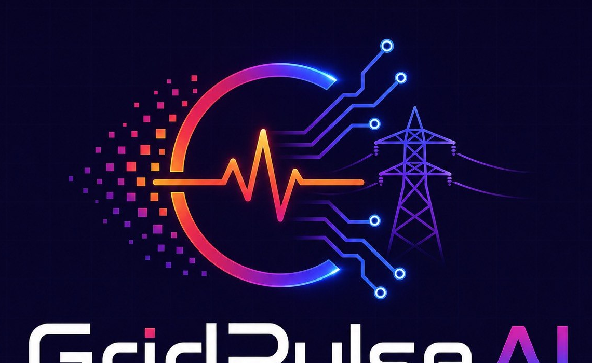

<div align="center">

<br/>




<br/>

### **Uninterrupted Power on Demand**

*A deterministic, agentic risk engine for extreme-heat grid resilience.*

<br/>


<br/>

> **GridPulse AI turns heat, demand, infrastructure, outage, and vulnerability data**
> **into a single, explainable risk score — and a funded action plan — before the grid fails.**

<br/>

</div>

---

## What is GridPulse AI?

**GridPulse AI** (internally, *GridHeat AI*) is an **agentic grid-resilience platform** that identifies which zones of a power grid are most at risk during extreme heat events, and recommends a constrained-budget action plan to mitigate that risk — with every number traceable back to real data, never an LLM guess.

The current pilot covers **Harris County, TX (Houston)** — selected from a candidate-county scoreboard combining heat exposure, EAGLE-I outage history, and EPA EJScreen vulnerability data.

| Traditional Approach | GridPulse AI |
|---|---|
| Manual heat-wave situation reports | Heat Agent (live NWS/live-heat feed by zone) |
| Utility load forecasting spreadsheets | Demand Forecast Agent (univariate + multivariate ERCOT models) |
| Static infrastructure maps | Grid Asset Agent (substations, transmission lines, battery storage) |
| Historical outage review, after the fact | Outage Agent (EAGLE-I county-level exposure scoring) |
| Equity impact assessed separately, later | Vulnerability Agent (EPA EJScreen indicators) |
| Risk assessed qualitatively, inconsistently | Deterministic Risk Engine (5 weighted, normalized components) |
| Ad-hoc crew/budget allocation | Constrained-budget Optimizer (exact 0/1 knapsack) |
| "Why was this funded?" — nobody remembers | LLM Explanation Layer, grounded and guardrailed |

---

## Architecture

GridPulse AI is built on a **LangGraph-powered agentic pipeline**, where each stage is a specialized node feeding a deterministic risk engine — never an LLM in the scoring path.

```
                              START
                                │
                                ▼
                          ┌───────────┐
                          │ HeatAgent │  live heat-by-zone
                          └─────┬─────┘
                                ▼
                    ┌─────────────────────┐
                    │ DemandForecastAgent │  linear / multivariate ERCOT model
                    └──────────┬──────────┘
                                ▼
                    ┌─────────────────────┐
                    │   GridAssetAgent    │  substations, lines, battery storage
                    └──────────┬──────────┘
                                ▼
                    ┌─────────────────────┐
                    │     OutageAgent     │  EAGLE-I county-level exposure
                    └──────────┬──────────┘
                                ▼
                    ┌─────────────────────┐
                    │ VulnerabilityAgent  │  EPA EJScreen indicators
                    └──────────┬──────────┘
                                ▼
                    ┌─────────────────────┐
                    │     RiskEngine      │  5-component weighted score, 0-100
                    └──────────┬──────────┘
                                ▼
                       route_by_risk(...)
                     ┌──────────┴──────────┐
                     ▼                     ▼
          ┌─────────────────────┐   ┌───────────┐
          │  ScenarioGenerator  │   │  Monitor  │
          │  (knapsack budget   │   │ (below    │
          │   optimizer + LLM   │   │ threshold)│
          │   explanation)      │   └─────┬─────┘
          └──────────┬──────────┘         │
                     ▼                     ▼
                    END                   END
```

---

## The Risk Engine

Five components, min-max normalized to 0–100 and weighted — no LLM in this path, fixed formulas only:

| Component | Weight | Source |
|---|---|---|
| **Heat** | 30% | Live heat-by-zone feed |
| **Demand Stress** | 25% | ERCOT demand model, spatially redistributed by infrastructure share |
| **Infrastructure Density** | 20% | Substations + transmission lines |
| **Historical Outage Exposure** | 15% | EAGLE-I county-level history |
| **Vulnerability** | 10% | EPA EJScreen |

Demand and outage scores are single county-level figures (EIA-930 and EAGLE-I have no zone-level breakdown) — scored against a real historical reference range rather than min-max'd across identical zones, then demand is redistributed proportional to each zone's built infrastructure share. Stated explicitly, never silently smoothed over.

---

## The Optimizer

Given a set of at-risk zones and a fixed budget, GridPulse AI solves an **exact 0/1 knapsack** (dynamic programming, not a greedy heuristic — greedy isn't guaranteed optimal here) across four candidate actions:

`Battery Dispatch` · `Crew Deployment` · `Demand Response` · `Emergency Monitoring`

> ⚠️ Action costs and risk-reduction percentages are **scenario assumptions** used to demonstrate constrained optimization — not utility-specific cost estimates or empirically calibrated intervention effects. This disclaimer is surfaced everywhere a plan is displayed.

---

## The Explanation Layer

A Groq-hosted LLM turns the deterministic risk table and optimizer output into a natural-language "why" — and never computes or changes a score or funding decision. Every response passes:

- **Self-attribution check** — rejects phrasing implying the LLM made the decision
- **Numeric-grounding check** — rejects any figure that doesn't trace back to the evidence packet

A failed check triggers one retry, then falls back to a template built from the same evidence — never an ungrounded explanation, never a broken dashboard. No API key configured means the dashboard still renders and simply skips the LLM step.

---

## Project structure

```
backend/         # config, data access, risk engine, optimizer, LangGraph, LLM explanation, FastAPI app
frontend/        # Streamlit dashboard (direct backend import, no HTTP)
web/             # Next.js dashboard (consumes backend/api.py as JSON)
notebooks/       # Colab data pipeline — generates the artifact files in data/
tests/           # pytest suite (API, graph, LLM explanation)
data/            # generated artifacts (gitignored) — copy from notebook outputs
```

---

## Running locally

**Terminal 1 — API:**
```bash
source venv/bin/activate
uvicorn backend.api:app --reload --port 8000
```
Runs on `http://localhost:8000` — falls back to `backend/mock_data.py` automatically if `data/` hasn't been populated yet, so it works with zero setup.

**Terminal 2 — Web frontend:**
```bash
cd web
npm run dev
```
Runs on `http://localhost:3000`

**Alternative — Streamlit frontend (imports backend directly, no API needed):**
```bash
streamlit run frontend/app.py
```

Populate `data/` per `backend/config.py` with the artifacts from `notebooks/GridHeat_AI_Pipeline_Texas.ipynb` to run against real Harris County data instead of mock data.

---

## Roadmap

| Status | Feature |
|---|---|
| ✅ | Deterministic 5-component Risk Engine |
| ✅ | LangGraph agentic pipeline (Heat → Demand → Assets → Outage → Vulnerability → Risk) |
| ✅ | Constrained-budget optimizer (exact 0/1 knapsack) |
| ✅ | Guardrailed LLM explanation layer |
| ✅ | FastAPI + Next.js dashboard |
| ⬜ | Multi-county expansion beyond the Harris County pilot |
| ⬜ | Live ERCOT/EIA feature refresh in production |

---

## License

This project is licensed under the **MIT License** — see the [LICENSE](LICENSE) file for details.

---

<div align="center">

**GridPulse AI — Uninterrupted Power on Demand.**

<br/>


<br/>

*© 2026 GridPulse AI. All rights reserved.*

</div>
